# Your ♥ Café

  

##### Главная страница (URL)

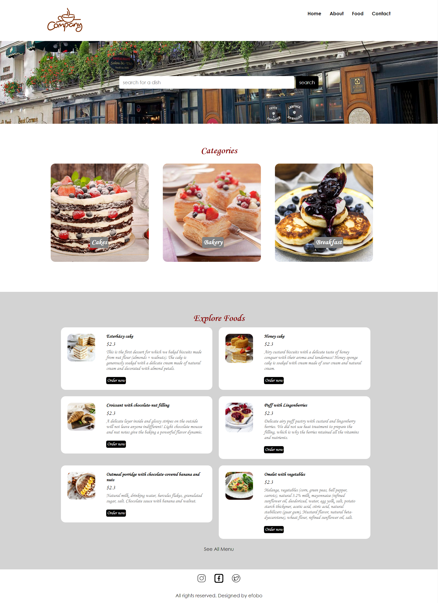

  

##### URL/admin/

Добавлены возможности:

<ul>
    <li>Авторизация</li>
    <li>Реализован Log out</li>
    <li>Защищенный вход в систему</li>
</ul>

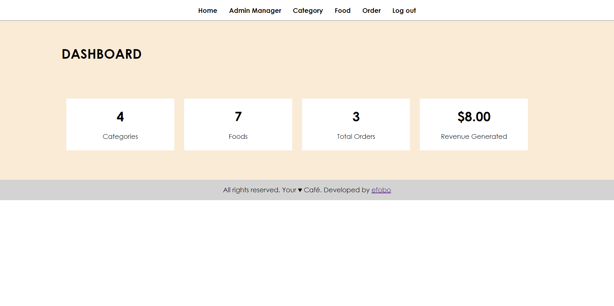

##### URL/admin/login.php

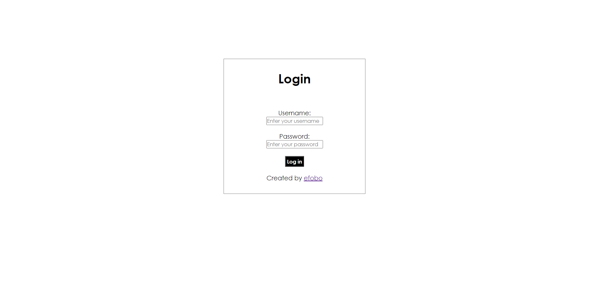

  

##### URL/admin/manage-admin.php

Добавлены возможности:

<ul>
    <li>Добавить админа</li>
    <li>Сменить пароль</li>
    <li>Обновить данные</li>
    <li>Удалить админа</li>
</ul>

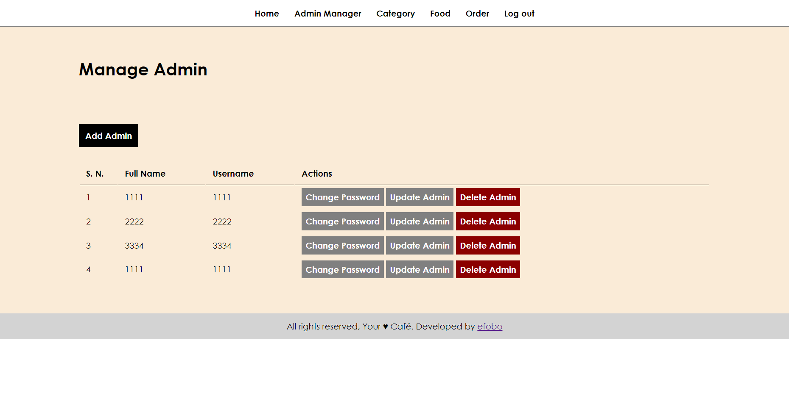

##### URL/admin/add-admin.php

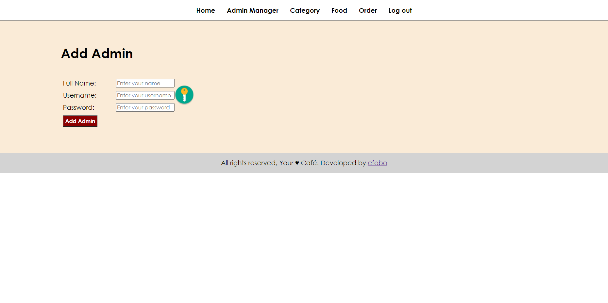

##### URL/admin/update-password.php

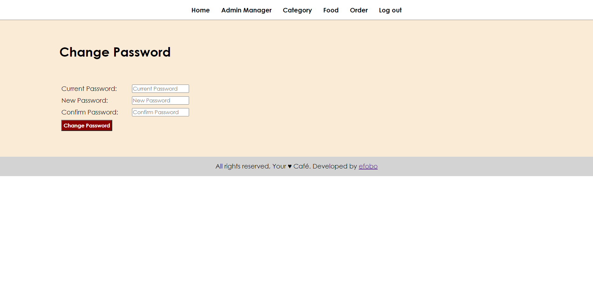

##### URL/admin/update-admin.php

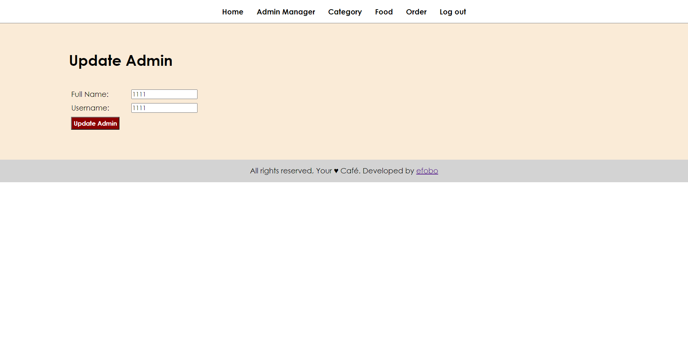

  

##### URL/admin/manage-category.php

Добавлены возможности:

<ul>
    <li>Добавить категорию</li>
    <li>Обновить данные о категории</li>
    <li>Удалить категорию</li>
</ul>

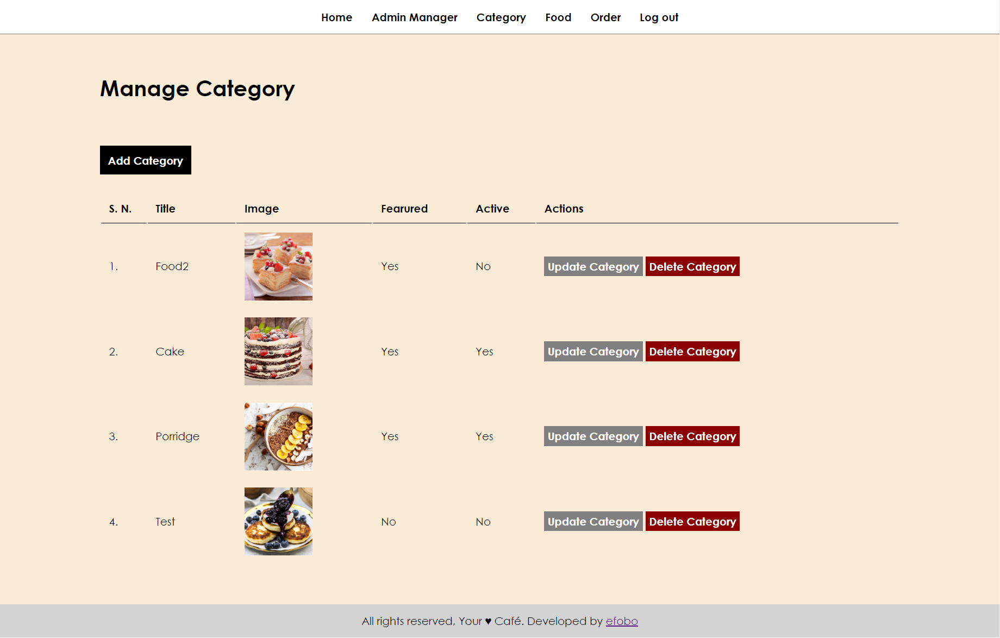

##### URL/admin/add-category.php

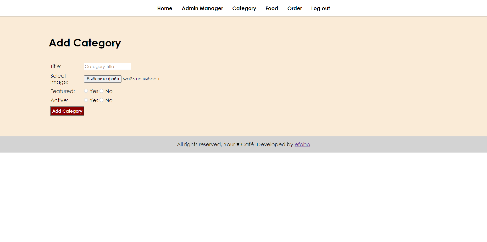

##### URL/admin/update-category.php

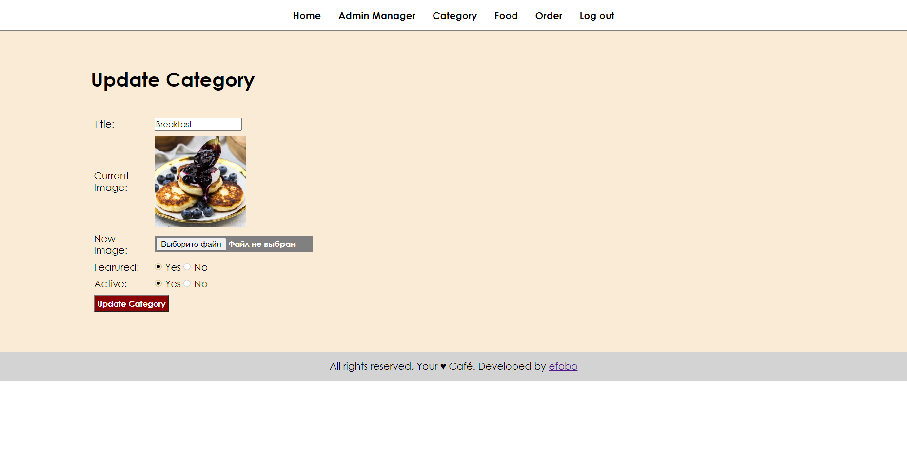

  

##### URL/admin/manage-food

Добавлены возможности:

<ul>
    <li>Добавить позицию в меню</li>
    <li>Обновить данные о позиции в меню</li>
    <li>Удалить позицию меню</li>
</ul>

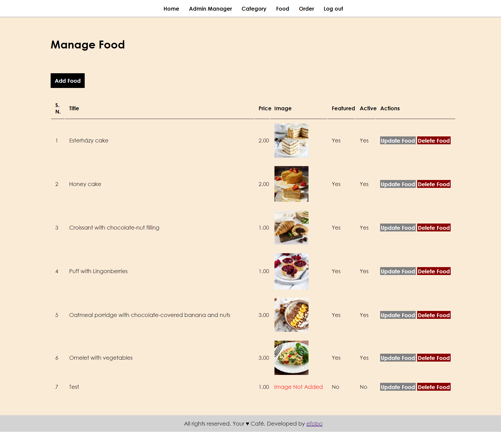

##### URL/admin/add-food.php

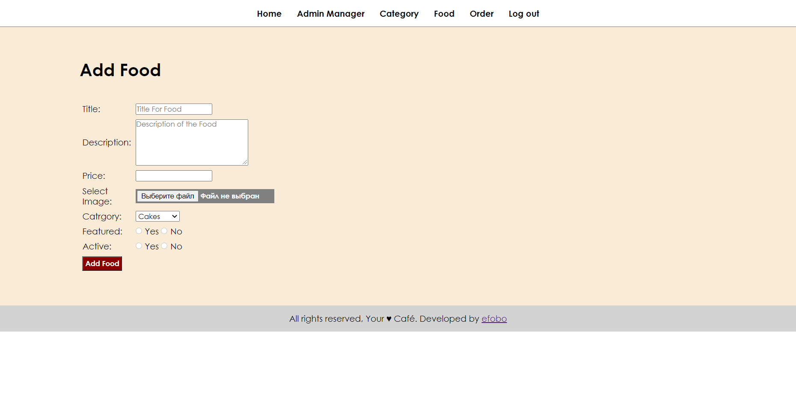

##### URL/admin/update-food.php

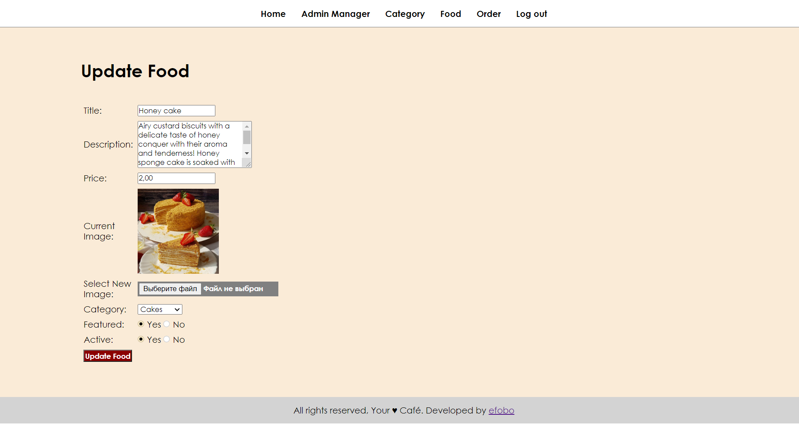

  

##### URL/admin/manage-order.php

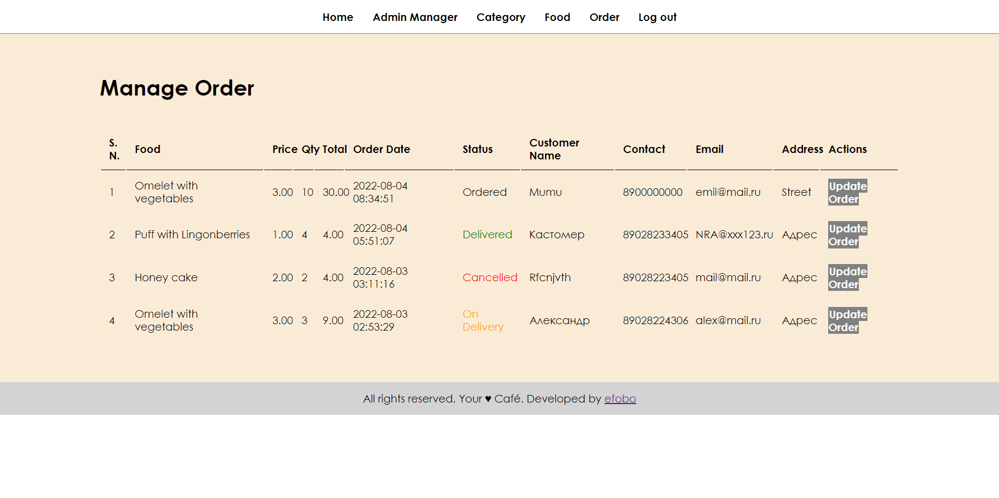

  

##### URL/admin/update-order.php

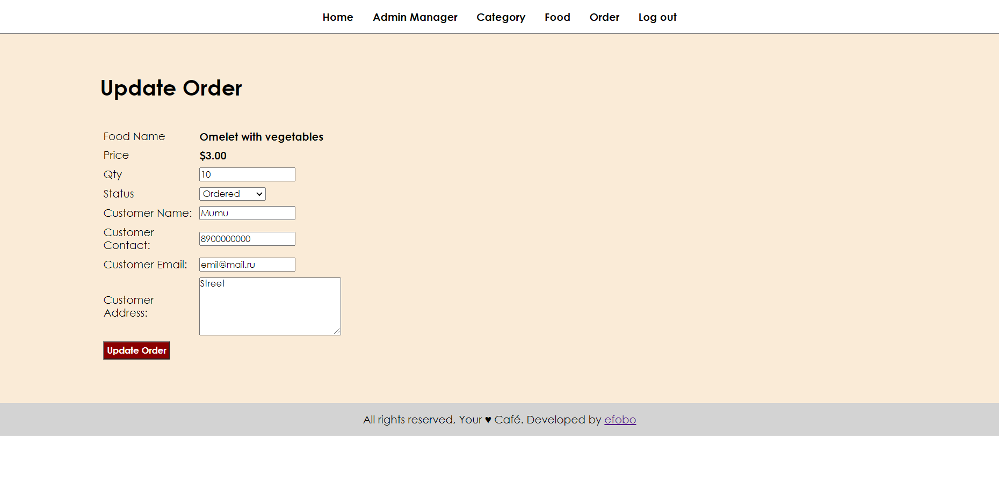

