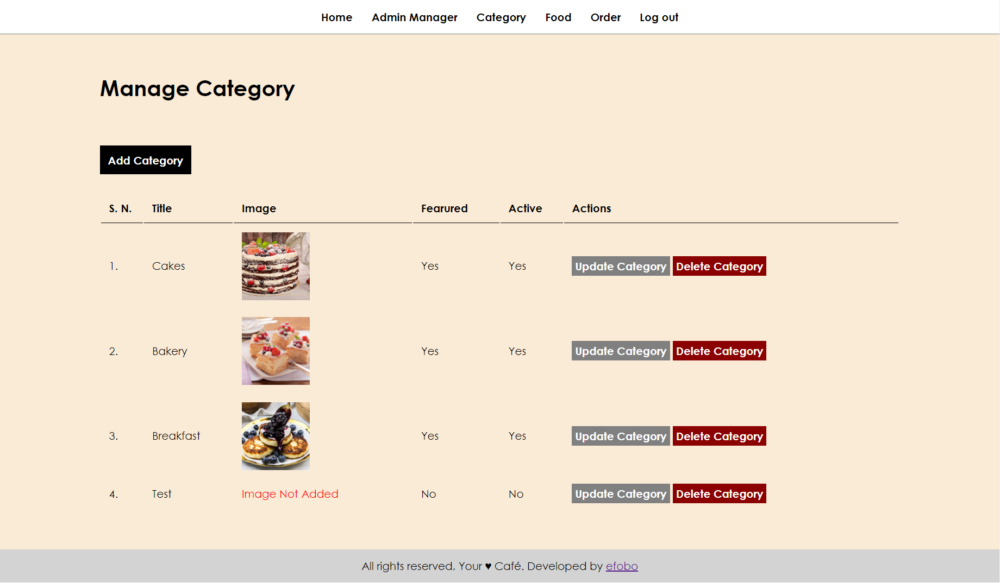
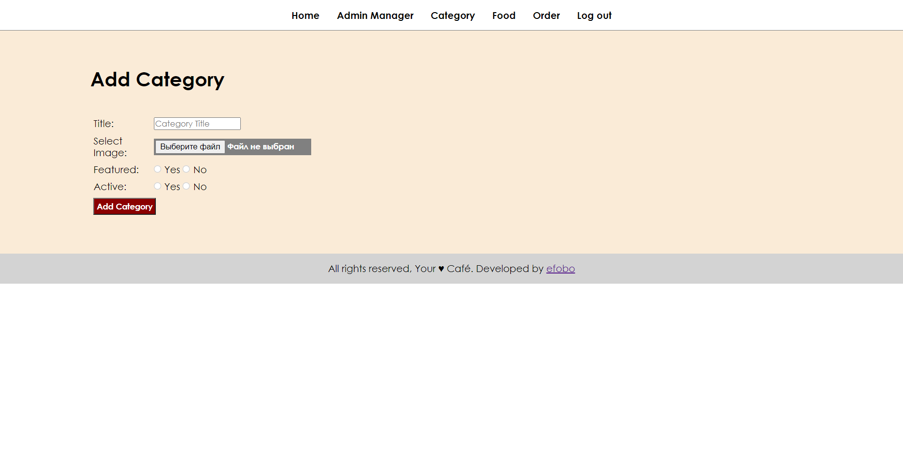

# htdocs

В разработке...

  

##### Главная страница (URL)

  

##### URL/admin/

Добавлены возможности:

<ul>
    <li>Авторизация</li>
    <li>Реализован Log out</li>
    <li>Защищенный вход в систему</li>
</ul>

##### URL/admin/login.php

  

##### URL/admin/manage-admin.php

Добавлены возможности:

<ul>
    <li>Добавить админа</li>
    <li>Сменить пароль</li>
    <li>Обновить данные</li>
    <li>Удалить админа</li>
</ul>

##### URL/admin/add-admin.php

##### URL/admin/update-password.php

##### URL/admin/update-admin.php

  

##### URL/admin/manage-category.php

Добавлены возможности:

<ul>
    <li>Добавить категорию</li>
    <li>Обновить данные о категории</li>
    <li>Удалить категорию</li>
</ul>

##### URL/admin/add-category.php

##### URL/admin/update-category.php

  

